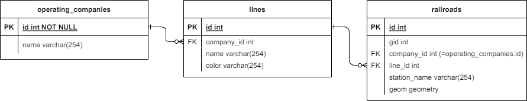

# db

## ソースデータ

https://uedayou.net/jrslod-geojson-downloader/ の改変です．

改変内容は主に以下の通りです．

* 駅を並走しているが駅に属していない線(急行線)を削除しています
* 一筆書きできない路線は別の線として分離しています
* 始点や終点が存在しない線に対して始点や終点を追加しています

geojsonは以下のリポジトリ・ブランチです  
https://github.com/unyacat/jrslod-geojson-all/tree/drail-deploy

## ファイル

### csv
会社データ・路線データです．

https://github.com/unyacat/jrslod-geojson-all/tree/drail-deploy のgeojsonファイルを読み込む時に利用できます．

### drail.dump

`pg_dump -d drail -h localhost -p 5432 -F custom -U postgres -W --verbose --file=drail.dump` の結果です．  

## ER図

